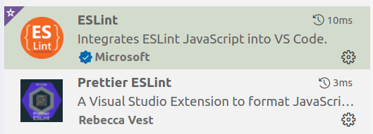

# 参与开发

[toc]

## Linter

- Danke 假设开发者都是在 VSCode 下进行开发。

- 目前项目中加入了 ESLint，请在 VSCode 中下载 ESLint 的两款插件，使得每次保存当前编辑文件时自动 lint。

  

## Database

- Danke 通过 TypeORM 与数据库交互，相关配置可见 `src/utils/config.ts`。为了能正常连接数据库，请参考如下流程在本地创建用户与对应数据库并赋予相应权限。

  ```
  sudo mysql # 进入数据库
  CREATE USER 'pink'@'localhost' IDENTIFIED BY 'password'; # 创建一个新的用户 pink，密码为 password
  FLUSH PRIVILEGES;
  CREATE DATABASE pink; # 创建 pink 数据库
  GRANT ALL PRIVILEGES ON `pink` . * TO 'pink'@'localhost'; # 将 pink 数据库的所有权限开放给用户 pink
  FLUSH PRIVILEGES;
  ```

- 虽然 TypeORM 支持 `synchronize` 以实现数据库表单的同步，但是在生产环境下不要开启该特性，否则会丢失数据。TypeORM 提供了相应的 migration 来维护数据库，但需要下载一个依赖。根目录下的 `ormconfig.json` 与 migration 相关，`src/utils/config.ts` 则与项目启动后的数据库交互相关。[^migration]

  ```bash
  npm install -g ts-node
  ```

- **数据库命名规范请遵照 [数据库命名规范.md](数据库命名规范.md) 执行。**

- 以下简要描述开发过程中如何创建一个新的表单

  - 首先在 `src/entities` 下定义表单对应的类。
  - 因为 `ormconfig.json` 做 migration 时依赖 `dist/entities` 下的文件（由 `ormconfig.json` 决定），因此需要 `yarn build`。
  - 然后通过 `yarn build && yarn typeorm migration:generate -n migrationNameHere` 在 `src/migrations` 下生成对应的 script，这里的 `migrationNameHere` 为生成的 script 的 filename，应反映 script 的具体操作，例如 `CreateUserAndMail`、`AlterUserAddRole`。生成的 script 格式有问题，但因为我们集成了 auto-lint，可以打开 script 后 Ctrl+S 自动调整。
  - 通过 `yarn build && yarn typeorm migration:show` 可以看到刚刚生成的 migrations 还没有同步到本地的数据库中（pending）。
  - 通过 `yarn build && yarn typeorm migration:run` 执行所有 pending 的 migrations。
  - 再次 `yarn typeorm migration:show` ，可以看到 migrations 已经同步到本地的数据库中。

- 当从 Github 拉下其他协作者的 commit 中有新的 migration 引入时，请通过如下方式同步数据库

  `yarn build && yarn typeorm migration:run` 。
  
- 导入数据：`yarn start:dev` 开发者模式下启动服务，在课程表数据的文件夹下运行 `bash scripts/import_lesson.sh` 导入数据。

## Mail

- 目前项目使用 

## Swagger

- 目前项目集成了 Swagger，用作 API 文档与接口测试（替代 Postman），在引入新的模块时请参考 user 模块下的 controller 与 dto 添加上相关的 decorator。[^swagger]
- 为了避免潜在的风险隐患，在 `src/main.ts` 下讲 swagger 配置成仅 dev 模式下才能访问，`yarn start:dev` 启动项目后，可在 http://localhost:3000/api/#/ 访问。
- Swagger 集成了 JWT，对于需要 JWT 的 controller 应该在其上添加 `@ApiBearerAuth('JWT')` 的 decorator。[^swagger-jwt]

## Reference

[^migration]:https://github.com/typeorm/typeorm/blob/master/docs/migrations.md#creating-a-new-migration
[^swagger]:https://juejin.cn/post/6844904125814063118
[^swagger-jwt]:https://github.com/nestjs/swagger/issues/98
